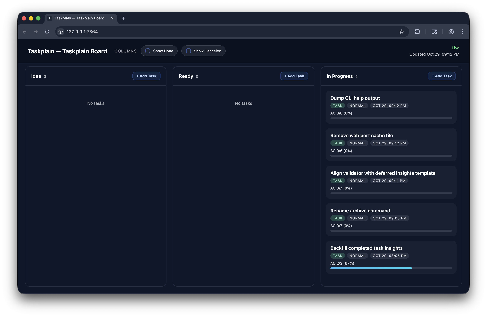

# Taskplain

[](https://github.com/fabiopelosin/Taskplain/actions/workflows/ci.yml) [](https://www.npmjs.com/package/taskplain)

**Task management designed for coding agents, living right in your repo.**

> 🧪 Experimental Project: Taskplain is an experiment in agentic AI coding workflows.

## What is Taskplain?

A lightweight task management system that stores tasks as plain Markdown files in your repository. Both you and your coding agents work from the same source of truth. No external ticketing system, no API tokens, just files that evolve with your code.

## Why Taskplain?

Modern coding agents can work for 5-10 minutes on a task, but they need clear structure and context. Taskplain gives you that structure:

**Human-in-the-loop oversight**: Agents document their plans in task files BEFORE coding and summarize their work AFTER completion. Review what will be dispatched before it runs, and get convenient summaries of what was accomplished in long agent sessions.

**Everything in the repo**: Agents have full access to the codebase during task creation and enrichment. They can reference actual code and task history, not just vague descriptions. Capture the why alongside the what, and avoid repeating learned mistakes.

**Async workflow**: Create and refine a backlog of well-specified tasks, then dispatch them to agents when ready. No more real-time back-and-forth to clarify requirements.

**Parallel execution without conflicts**: Multiple agents work independently on different tasks. Task history stays in-repo forever, providing institutional memory for future work.

**Tool-agnostic**: Works with any coding agent (Claude, Cursor, Aider, custom MCP servers). Git-oriented, so task history is searchable via `git log` and `grep`.

## How it Works

### 0. Initialize Taskplain

```bash
taskplain init
taskplain inject AGENTS.md
```

These two commands set up your repo to work with Taskplain. The first creates the tasks directory with the standard folder structure, and the second refreshes `AGENTS.md` so coding agents follow the Taskplain workflow.

### 1. Capture new work

```bash
# Quick capture when you spot something
taskplain new --title "Fix mobile navbar"
```

AI coding agents take those captures and flesh them out into ready tasks. Because tasks live in your repo, agents rely on familiar source-control tooling to search, edit, and research. They reference real code, link to files, and capture implementation details that would otherwise be lost outside the repository. Agents drive updates with the Taskplain CLI (`new`, `update`, `move`, `adopt`, `delete`, `pickup`, `complete`) so every action stays deterministic.

### 2. Structure and enrich

```yaml

id: fix-mobile-navbar
title: Fix mobile navbar
kind: task
state: ready
priority: high
size: small
ambiguity: low
executor: standard
isolation: module
depends_on:
  - menu-a11y-review

## Overview
The navbar breaks at the 768px breakpoint on iOS Safari.

## Acceptance Criteria
- [ ] Hamburger menu appears correctly
- [ ] All links accessible

## Technical Approach
- Audit responsive breakpoints and consolidate to a single source of truth.
```

### 3. Dispatch to an agent

```bash
codex exec "Implement task: fix-mobile-navbar"
```

```text
# Inside the agent session
taskplain pickup fix-mobile-navbar
taskplain show fix-mobile-navbar
# Agent performs the work described in the task
taskplain complete fix-mobile-navbar
```

The CLI provides structured outputs that coding agents and orchestration tools can consume deterministically.

### 4. Monitor progress

```
taskplain web --open
```

The web interface provides real-time updates, shows which tasks are complete, and gives you a live pulse on active work.



The board now surfaces an animated live connection badge, tidier destructive action prompts, and a `Complete task` control inside the task modal so you can finish work without leaving the detail view.

## Task Organization

```
tasks/
  00-idea/        → rough ideas, not ready
  10-ready/       → specified, ready for pickup
  20-in-progress/ → being worked on
  30-done/        → completed
```

Tasks move through folders as they progress. Each file contains metadata for smart dispatching:

- `size`: tiny/small/medium/large/xl
- `priority`: none/low/normal/high/urgent
- `depends_on`: other task IDs that must complete first
- `executor`: simple/standard/expert/human_review
- `isolation`: isolated/module/shared/global
- `touches`: glob patterns describing the code it modifies

## Integration Examples

### With Multiple Agents

Dispatch ready-state tasks to agents; `taskplain next` only surfaces work from the ready queue.

```bash
# Dispatch ready tasks to multiple agents
while IFS= read -r task_id; do
  codex exec "Implement task: $task_id" &
done < <(taskplain next --parallelize 3)

wait
```

### With CI/CD

The repository ships a GitHub Actions workflow (`ci.yml`) that runs on every push and pull request to `main`. It installs dependencies with pnpm, runs the full `pnpm verify` pipeline, and finishes by executing `node dist/cli.js validate`. The job reuses dependencies via `pnpm/action-setup` and the `actions/setup-node` pnpm cache so cold installs stay fast while still honoring the lockfile.

```bash
# Ensure the repo toolchain stays green
pnpm verify
# Ensure all tasks validated before merge
taskplain validate --strict
```

## Documentation

- [Product Requirements](./docs/product.md): Vision, goals, and scope
- [CLI Playbook](./docs/cli-playbook.md): Taskplain command recipes and workflows
- [Architecture](./docs/architecture.md): System design and interfaces
- [Tech Stack](./docs/tech.md): Dependencies and tooling
- [Change Log](./docs/changelog.md): Notable updates

CLI reference quick links:

- Full human-readable listing: `taskplain help --all`
- Machine-readable contract: `taskplain help --json`
- Handbook content/snippet verification: `taskplain help handbook --section overview`

## Requirements

- Node.js 18+
- Git (recommended)

## Installation

```bash
npm install -g taskplain
taskplain init
```

## License

MIT
