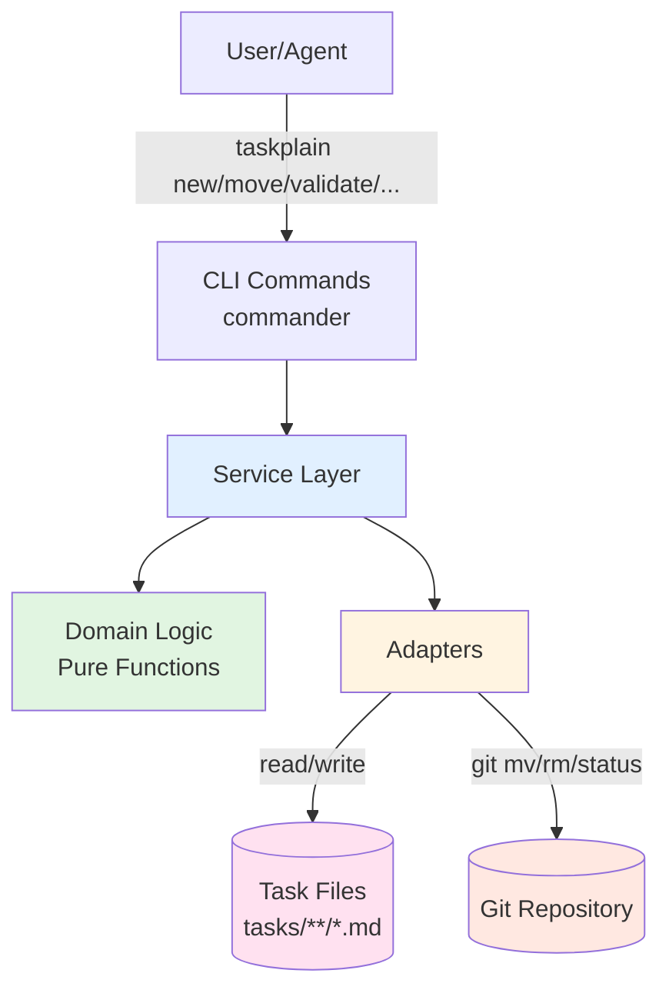
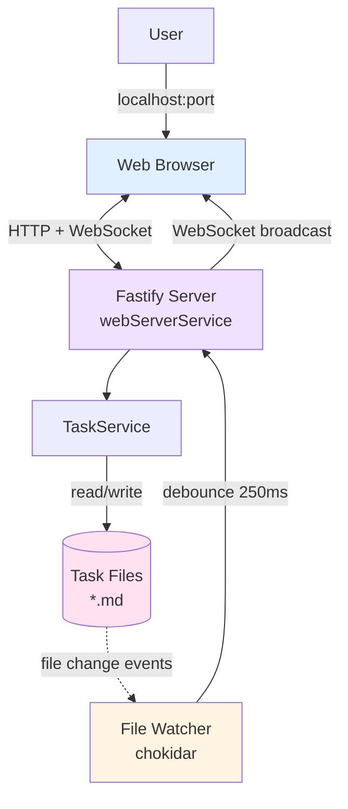
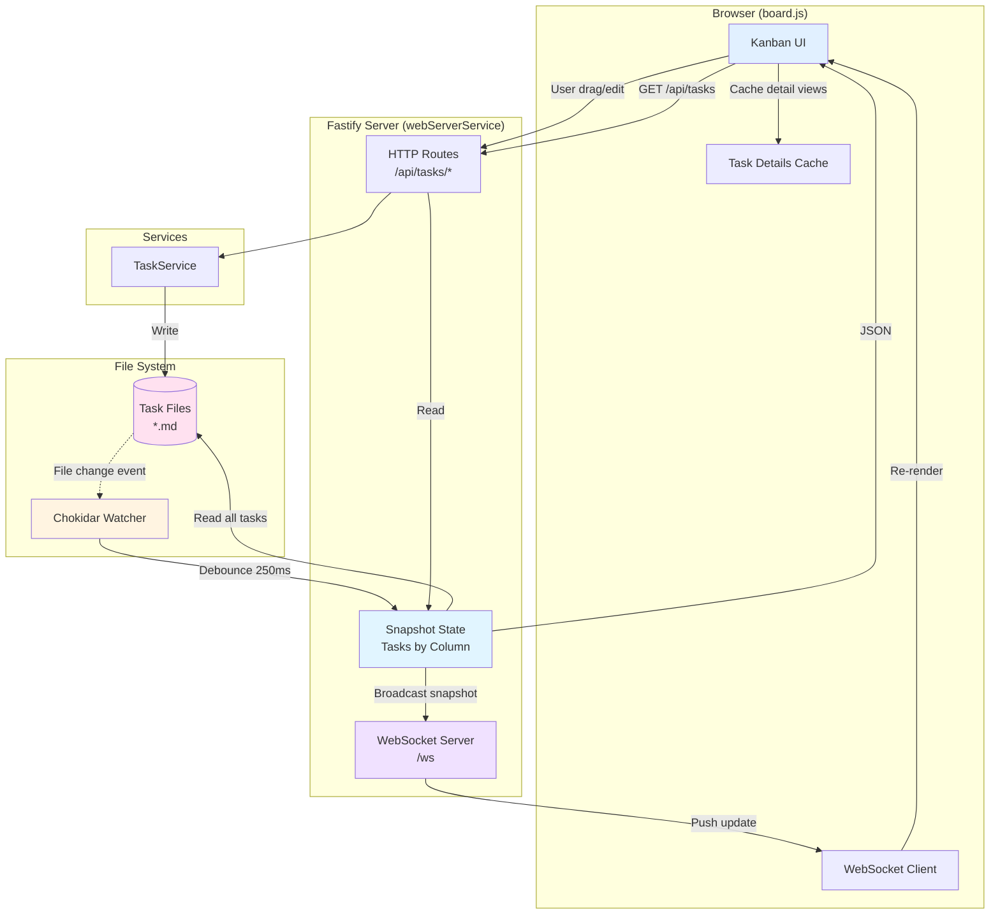
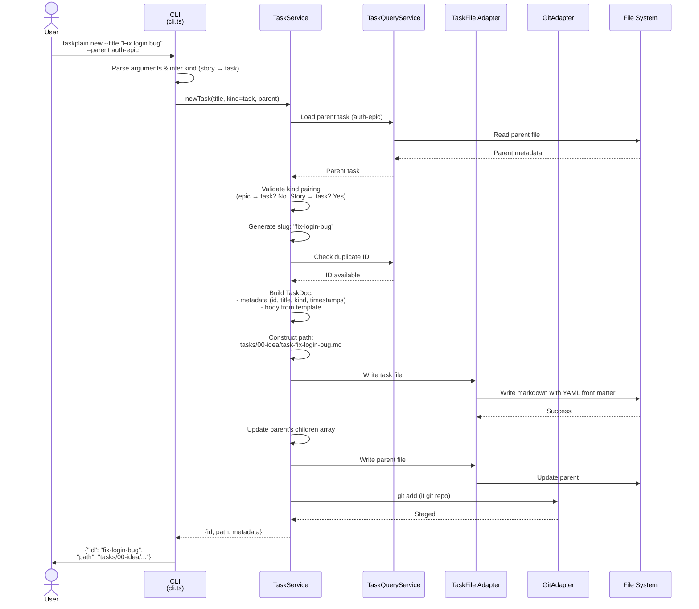
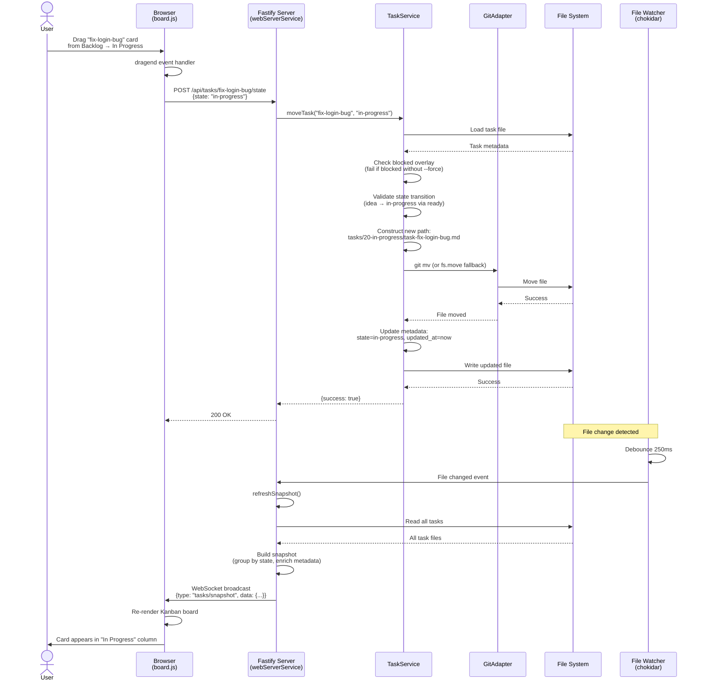
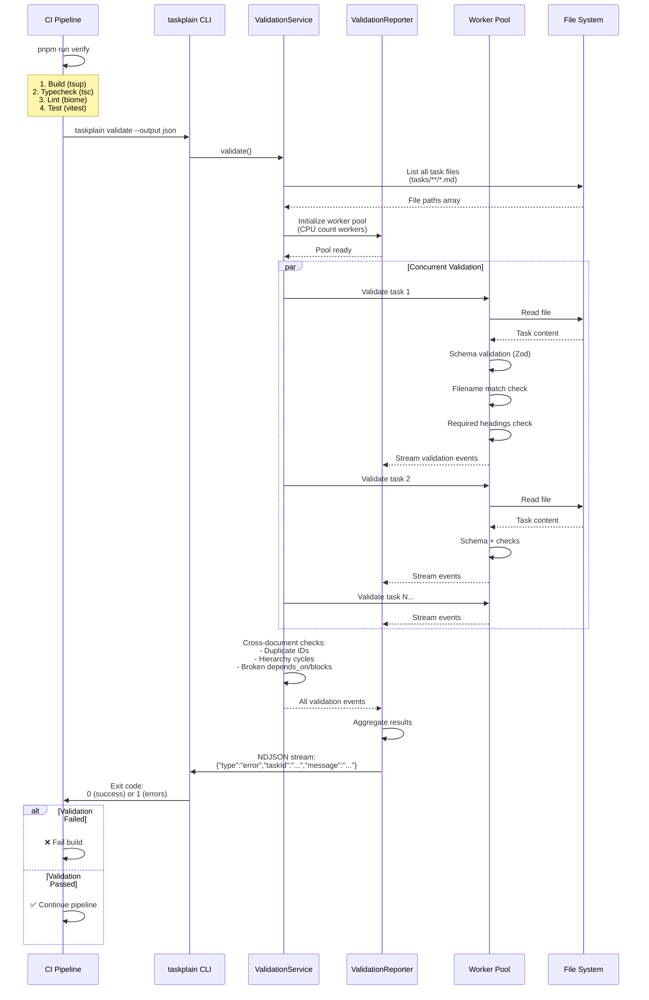
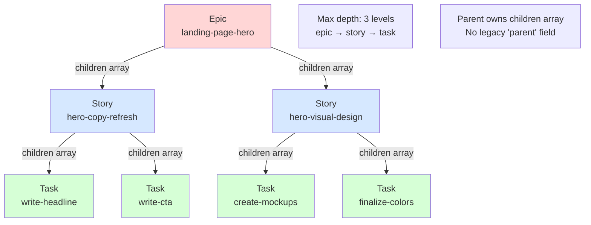
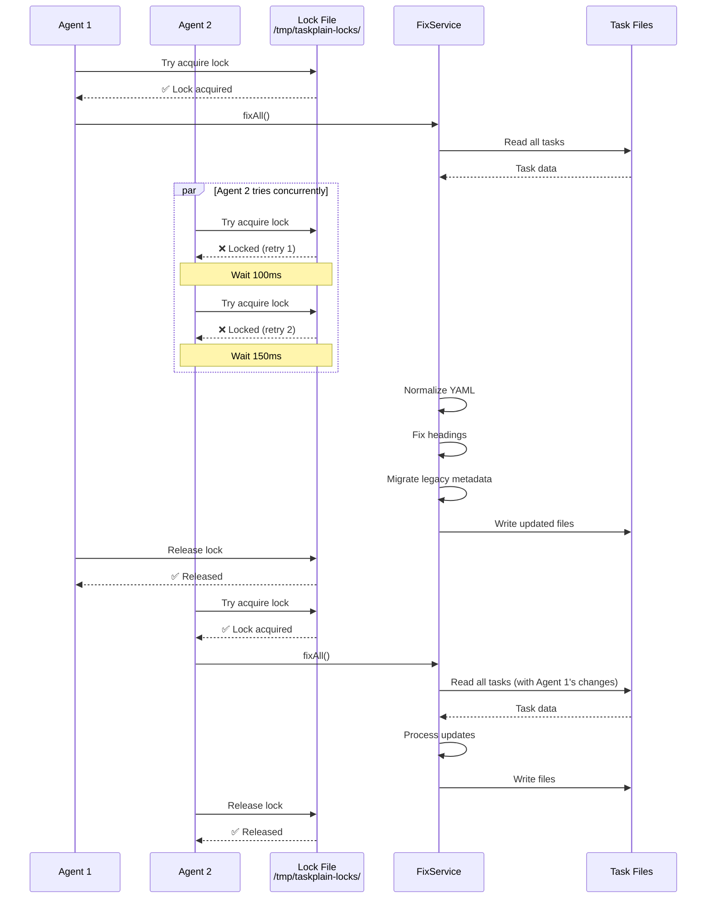

# Architecture

## Overview

Taskplain is a deterministic CLI for managing repository-native task files stored as Markdown with YAML frontmatter.

### Core Architecture Principles

**Repository as Source of Truth**
One Markdown file per task in `tasks/` directory. No external databases, caches, or materialized views persisted to disk. Git provides versioning, history, and distribution.

**Convention Over Configuration**
Fixed directory structure (`tasks/{00-idea,10-ready,20-in-progress,30-done,40-canceled}/`), standardized filenames, deterministic metadata schemas. No per-repository configuration files.

**Deterministic Operations**
All CLI commands are idempotent with stable JSON output. Same inputs always produce same results, enabling reliable automation for AI agents and CI pipelines.

**Layered Architecture**
Clear separation: Domain (pure logic) → Adapters (I/O) → Services (business logic) → CLI (presentation). Each layer has well-defined responsibilities.

**Developer Experience**
Fast local workflows, optional ephemeral web UI (`taskplain web`), git-aware operations, extensive dry-run support.

### Target Environment

- **Runtime**: Node.js 18+
- **Platforms**: macOS, Linux, Windows
- **Distribution**: npm package (`@taskplain/cli`) with CLI binary
- **Build**: TypeScript compiled to CommonJS via tsup

### Non-Goals

- Per-repository configuration files (convention-based only)
- Persistent materialized views or disk caches
- Long-running daemons (web server is ephemeral, local-only)
- Bidirectional sync with external issue trackers
- Monorepo support in v0.1

## Key Decisions

### Parent-Owned Hierarchy

Parent tasks (epics/stories) own ordered `children` arrays in YAML frontmatter. Child tasks do not store a `parent` field.

**Why**: Enables deterministic execution order, simplifies tree rendering, and provides a single source of truth for task relationships. Migration happens automatically via `taskplain validate --fix`.

### Repository as Database

Tasks are Markdown files with YAML frontmatter stored in `tasks/`. No external databases, caches, or materialized views. Git provides versioning and distribution.

**Why**: Zero setup cost, works offline, inherits Git's branching/merging, makes task changes reviewable in PRs, eliminates API dependencies.

### Structured Dispatch Metadata

Tasks include dispatch metadata for agent selection: `size`, `ambiguity`, `executor`, `isolation`, `touches`, `depends_on`, `blocks`.

**Why**: Enables `taskplain next` to rank ready work and detect parallel execution conflicts. Agents can filter by `executor` type and avoid touching conflicting modules simultaneously.

### Permissive State Transitions

Allow transitions between any task states (idea ↔ ready ↔ in-progress ↔ done ↔ canceled). Hierarchy consistency enforced by `TaskService.complete` and validation, not state machine.

**Why**: Operators need flexibility to restore or reclassify tasks without artificial barriers. Real invariants (like "epic completion requires child completion") are handled separately through business logic.

### Conventional Commits with Task Trailers

Use standard [Conventional Commits](https://www.conventionalcommits.org/) format with `[Task:<id>]` trailer. Example: `feat(cli): add list command [Task:cli-list]`

**Why**: Aligns with industry standard, enables semantic versioning tooling, reduces CLI surface area (removed `taskplain subject` command), provides bidirectional traceability between commits and tasks.

## System Architecture Diagrams

### Core Architecture (CLI)



**Key Principle**: Repo is the database. All state lives in markdown files under `tasks/`. The CLI enforces conventions and provides deterministic operations.

**Architectural Layers**:

- **Domain** (pure logic, no I/O): Types, state machine, path rules, schemas
- **Adapters** (external integration): TaskFile adapter (gray-matter + YAML), GitAdapter (simple-git wrapper)
- **Services** (business logic): TaskService, ValidationService, CleanupService, WebServerService, NextService, FixService, etc.
- **CLI** (presentation): Commander-based command routing, parsing, formatting, error handling

> Technology choices, toolchain details, and dependency rationale now live in `docs/tech.md`.

## Codebase Structure

### Directory Layout

```
src/
├── cli.ts                    # CLI entry point with Commander setup
├── index.ts                  # Programmatic API exports
├── domain/                   # Pure domain logic (no I/O)
├── adapters/                 # External system integration
├── services/                 # Business logic layer
├── utils/                    # Shared utilities
├── docsources/              # Template files for code generation
└── resources/
    └── web/                 # Static web UI assets (copied to dist/ during build)
```

### CLI Command Organization

**Entry Point**: [src/cli.ts](../src/cli.ts)

Commander subcommands are defined inline in `cli.ts`. Each command:

1. Parses options/arguments
2. Calls appropriate service layer functions
3. Formats output (human tables, JSON, or IDs-only)
4. Handles errors with proper exit codes

**Major Command Groups**:

- See CLI help and handbook for the full surface: `taskplain --help` and `taskplain help handbook --section all --format md`.

### Web Interface

**Pattern**: Embedded Single-Page Application (SPA)

Taskplain is **CLI-first**, but offers a local web UI for visual task management via `taskplain web`.

**High-Level Architecture**:



**Backend** ([src/services/webServerService.ts](../src/services/webServerService.ts)):

```
Fastify HTTP Server (127.0.0.1:deterministic-port)
├── GET  /                       → Serve board.html
├── GET  /assets/:file           → Serve CSS/JS from resources/web/
├── GET  /api/health             → Health check, returns `{ projectPath }`
├── GET  /api/tasks              → Full task snapshot (JSON)
├── GET  /api/tasks/:id          → Detailed task data
├── POST /api/tasks              → Create new task
├── PATCH /api/tasks/:id         → Update metadata/body
├── POST /api/tasks/:id/state    → Move task to new state
├── DELETE /api/tasks/:id        → Delete task (with cascade)
└── GET  /ws                     → WebSocket endpoint for live updates
```

**Frontend** ([src/resources/web/board.js](../src/resources/web/board.js)):

- **Architecture**: Vanilla JavaScript (no framework), IIFE
- **State Management**: Closure-scoped variables + `sessionStorage` for preferences
- **Key Features**:
  - Kanban columns with drag-and-drop state transitions
  - Multi-modal UI: task details, body editor, child creation, delete confirmation
  - Markdown preview with GFM support (via CDN `marked.js`)
  - Acceptance criteria progress bars
  - Parent-child hierarchy navigation with cross-state links
  - Real-time WebSocket sync with auto-reconnection
  - Animated live connection badge with accessible tooltip and reduced-motion fallback
  - Inline `Complete task` action inside the task modal to finish work without leaving context
  - Harmonized confirmation dialogs with consistent button spacing and sizing
  - Confetti animations on task completion (via CDN `canvas-confetti`)

**Design Rationale**:

- Zero build step at runtime (HTML/CSS/JS are static files)
- Works offline after initial load (CDN dependencies have inline fallbacks)
- Small bundle size
- No framework lock-in or version churn
- **Ephemeral**: Server runs only when needed, no long-running daemon
- **Deterministic port + tab identification**: The CLI derives a stable port from the project path (range 8000–8999), probes `/api/health` to reuse an existing server for the same repo, increments on collisions with other Taskplain projects, and skips ports used by non-Taskplain processes. The page title is `Taskplain: {project-name}` and the favicon is a static Taskplain icon for consistent tab recognition.

### Real-Time Update Flow



**Key Features**:

1. **Optimistic UI**: Drag operations update immediately, server validates
2. **Debounced updates**: 250ms delay prevents event storms from rapid file changes
3. **Auto-reconnection**: WebSocket client retries with 1500ms delay after disconnect
4. **Snapshot caching**: Server maintains in-memory snapshot, rebuilds on file changes
5. **Client-side cache**: Detail views cached to reduce API calls

## Conventions and invariants

Directory layout

```
tasks/
  00-idea/
  10-ready/
  20-in-progress/
  30-done/
  40-canceled/
```

Legacy `backlog`/`todo` aliases have been removed. Run `taskplain validate --fix --rename-files` before upgrading if any repositories still carry the old slugs.

Filenames

- Active: `[kind]-[id].md`
- Done: `[YYYY-MM-DD] [kind]-[id].md`
- Only hyphens in names. No spaces. No counters.

YAML front matter keys

```
id, title, kind, parent, state, priority,
children,
size, ambiguity, executor, isolation,
touches, depends_on, blocks,
blocked,
assignees, labels, created_at, updated_at, completed_at,
links, last_activity_at
```

Required headings

```
## Overview
## Acceptance Criteria
## Technical Approach
## Post-Implementation Insights
### Changelog
### Decisions
### Architecture
```

The default scaffold now includes empty Post-Implementation subheadings so agents can drop in concise bullets as work ships. Populate **Changelog** before marking a task done, and fill **Decisions**/**Technical Changes** whenever notable outcomes exist. Keep Technical Changes to roughly ten lines so reviewers can scan the code impact quickly.

State intent

| State   | Purpose                                                                                                                                                                                           |
| ------- | ------------------------------------------------------------------------------------------------------------------------------------------------------------------------------------------------- |
| `idea`  | Idea/proposal inbox. Items can be rough, may lack dispatch metadata, and often require clarifying questions or research. Keep them here until triage is complete.                                 |
| `ready` | Triaged and ready to execute. Every section is filled out, metadata (`size`, `ambiguity`, `executor`, `isolation`, `touches`) is set, dependencies are recorded, and open questions are resolved. |

Triage means validating the ask with the requester, updating all required sections, capturing technical approach notes, and only then moving the task into `ready` so `taskplain next` and `taskplain pickup` surfaces stay actionable—they only consider ready-queue work.

Hierarchy

- epic → story → task. Depth ≤ 3. No cycles. Epics/stories own ordered `children` arrays in YAML to describe execution order, and the body no longer includes a `## Children` section. Stories and tasks may exist without a parent and appear in the “ungrouped” CLI buckets.
- Kind heuristics:
  - **Epic** — Multi-story initiatives that need progress rollups and cross-release coordination. Completion remains blocked until every descendant is done.
  - **Story** — Reviewable outcomes that organise several tasks or evolving scope; begin uncertain work here and attach tasks as the plan solidifies.
  - **Task** — Leaf execution steps for a single contributor or tight pair; they should not own children and are what scheduling surfaces ultimately pick up.
  - **Reclassify quickly** — When scope grows, create a story wrapper (optionally under an epic) and use adoption helpers to move existing children rather than stretching a task or story beyond its intent.
- Managed snippet markers: `AGENTS.md` contains a Taskplain-owned block bounded by `<!-- taskplain:start v0.1.0 -->` / `<!-- taskplain:end -->` (the version matches the CLI). Only the CLI updates this region, and refreshing it after upgrades is the recommended workflow even though the file sits outside `tasks/`.
- Managed snippet updates run via `taskplain inject <file>`; freshness checks use `taskplain inject <file> --check`.
- Canonical handbook sources live in [`src/docsources/handbook-template.md`](../src/docsources/handbook-template.md) and [`src/docsources/handbook-snippet.md`](../src/docsources/handbook-snippet.md); the CLI reads those files when rendering.
- Default task bodies come from [`src/docsources/task-template.md`](../src/docsources/task-template.md). `TaskService` seeds new work directly from that file and `FixService` reuses it when inserting missing headings so editing one markdown asset updates every scaffold.
- Aggregated CLI reference: `taskplain help --all` prints the concatenated `--help` output for the root command plus every visible subcommand; use `taskplain help --json` to stream the machine-readable contract for agents/CI.

Validation levels

- Errors: Block workflow (schema failures, invalid parents, cycles, depth > 3, epics marked done with non-done descendants).
- Warnings: Heuristics that surface likely drift without blocking (e.g., idea parents with done/in-progress children, canceled parents with active children, done parents with canceled children). Use `taskplain validate --strict` to treat warnings as errors in CI.

## Architectural Layers

### Layer 1: Domain (Pure Logic)

**Location**: `src/domain/`

**Purpose**: Pure functions and types with zero I/O dependencies. This layer defines the core rules and contracts.

**Key Modules**:

- `types.ts` — Core types (`State`, `Kind`, `TaskMeta`, `TaskDoc`) + Zod schemas for runtime validation
- `stateMachine.ts` — State ordering and a permissive transition policy. All state-to-state moves are allowed; parent/child completion rules and hierarchy consistency are enforced by validation and `TaskService.complete`.
- `paths.ts` — Path construction rules (`stateDir()`, `activeName()`, `doneName()`)
- `sections.ts` — Required heading definitions and section parsing
- `canonical.ts` — Canonical enums, metadata defaults, handbook content sources
- `normalization.ts` — Metadata normalization rules and validation heuristics
- `content.ts` — Markdown body parsing utilities (acceptance criteria extraction)

**Architectural Principle**: Domain layer can be imported by any other layer but imports nothing except Node.js built-ins.

### Layer 2: Adapters (External Integration)

**Location**: `src/adapters/`

**Purpose**: Wrap external libraries and system interactions with domain-specific interfaces.

**Key Adapters**:

**TaskFile Adapter** (`taskFile.ts`):

- Wraps `gray-matter` for YAML front matter parsing
- Uses `yaml` library with Document API for deterministic serialization
- Preserves comments in YAML
- Emits normalization warnings (e.g., unknown fields, risky metadata combinations)
- **Read path**: File → gray-matter → validate → normalize → `TaskDoc`
- **Write path**: `TaskDoc` → normalize → YAML serialize (stable key order) → file

**Git Adapter** (`gitAdapter.ts`):

- Wraps `simple-git` for git operations
- Provides: `gitMove()` (prefers `git mv`), `getStatus()`, `stageFiles()`
- Used by `TaskService` (for state moves) and `FixService` (for renames)
- Falls back to filesystem operations when git is unavailable

### Layer 3: Services (Business Logic)

**Location**: `src/services/`

**Purpose**: Orchestrate domain rules, adapters, and cross-cutting concerns (validation, caching, locking).

**Core Services**:

**TaskService** (`taskService.ts`):

- **Primary write path** for all task mutations
- Operations: `newTask()`, `updateTask()`, `moveTask()`, `completeTask()`, `deleteTask()`, `adoptChild()`
- Enforces:
  - State machine rules (via domain layer)
  - Blocking semantics (`blocked` overlay prevents moves except to `canceled`)
  - Hierarchy rules (epic → story → task depth limit, cycle prevention)
  - Timestamp maintenance (`created_at`, `updated_at`, `last_activity_at`, `completed_at`)
- Git-aware: prefers `git mv` for file moves, stages changes
- Dry-run support for all mutations
- **Unit test coverage**: 80%+ (lines/statements/functions), 70%+ branches (enforced by Vitest)

**TaskQueryService** (`taskQueryService.ts`):

- **Read-only** queries: list, filter, tree building
- Supports filtering by: state, priority, kind, size, ambiguity, executor, isolation, labels, parent, search terms
- Special modes: `--open` (idea/ready/in-progress only), `--blocked`/`--unblocked`
- Builds in-memory hierarchy indexes (parent→children mapping)

**NextService** (`nextService.ts`):

- **Ranks ready tasks** for `taskplain next` command (in-progress work is excluded)
- Candidate pool only includes ready-state work, explicitly skipping `idea` and `in-progress` tasks before ranking
- Uses `taskRanking.ts` heuristics:
  - Priority (urgent → high → normal → low → none)
  - Epic in-flight status (prefer tasks under active epics)
  - Size (prefer smaller tasks)
  - Executor fit (match agent capabilities)
  - Ambiguity (prefer low ambiguity)
  - Isolation (prefer isolated work)
  - Staleness (`updated_at` age)
- **Touch conflict detection**: `--parallelize N` option ensures selected tasks don't overlap in `touches` globs

**PickupService** (`pickupService.ts`):

- Assembles **full context** for `taskplain pickup <id>` workflow
- Steps:
  1. Load task and all ancestors (parent chain)
  2. Promote idea ancestors to `ready` (if any)
  3. Move target task to `in-progress`

4.  Rank direct children using NextService heuristics
5.  Return: ancestor metadata + bodies + ranked children

- Dry-run support to preview promotions/moves

**CleanupService** (`cleanup.service.ts`):

- Powers `taskplain cleanup` for pruning old completed tasks
- Steps:
  1. Scan all tasks, filtering those in `done` older than the requested age threshold
  2. Validate that no active work depends on the candidates and that no active children remain
  3. Extract Post-Implementation Insights subsections (Changelog, Decisions, Technical Changes) for downstream documentation
  4. Delete the underlying Markdown files via `TaskService.deleteTask`, updating parent `children` arrays as needed
- Warnings are emitted when changelog entries are missing, but cleanup proceeds; operators are expected to finish documentation and rely on Git history for recovery if necessary

**ValidationService** (`validationService.ts`):

- **Schema validation**: Zod schema checks on all YAML metadata
- **Hierarchy validation**:
  - Epic → story → task kind pairing enforcement
  - Cycle detection in parent-child relationships
  - Depth limit (≤3 levels)
  - Orphan detection (children references that don't exist)
- **Cross-document checks**:
  - Duplicate ID detection
  - `depends_on`/`blocks` reference validation (IDs must exist)
  - Terminal state blocking checks (warns if done/canceled tasks are marked blocked)
- **Filename validation**: Ensures filename matches `state` + `kind` + `id`

**ValidationReporter** (`validationReporter.ts`):

- **Streaming event collector** for validation results
- Concurrent validation with configurable worker pool (defaults to CPU count)
- Output modes:
  - **Human**: Groups issues by file, ANSI colors, hints for fixes
  - **JSON**: Newline-delimited JSON events (NDJSON) for machine parsing

**FixService** (`fixService.ts`):

- **Automatic repairs** for common issues:
  - Normalize YAML key order (stable, deterministic)
  - Insert missing required headings (`## Overview`, `## Acceptance Criteria`, etc.)
  - Migrate legacy `parent` metadata to parent-owned `children` arrays
  - Fix filename mismatches (via `--rename-files` flag)
- **Locking**: Uses `proper-lockfile` with repo-scoped lock in `${TMPDIR}/taskplain-locks/`
- **Git-aware**: Checks `git status` to skip timestamp updates on unmodified files
- Only rewrites files when actual changes detected (prevents spurious `updated_at` bumps)

**WebServerService** (`webServerService.ts`):

- **Fastify HTTP server** + WebSocket for local Kanban UI
- Serves static assets from `dist/resources/web/`
- REST API: CRUD operations proxy to `TaskService`
- **Real-time updates**: `chokidar` watches `tasks/**/*.md` → 250ms debounced snapshot refresh → WebSocket broadcast
- Snapshot enrichment: includes acceptance criteria stats, parent/child family context
- Security: path traversal prevention, repo root sandboxing
- **Browser launcher**: Optionally opens browser via `open` package

**Other Services**:

- `hierarchy.ts` — Builds parent→children index from task files
- `handbookService.ts` — Generates handbook content, manages snippet injection into `AGENTS.md`
- `describeService.ts` — Exports machine-readable CLI contract (JSON)

### Layer 4: CLI Commands

**Location**: `src/cli.ts`

**Framework**: `commander`

**Architecture**:

- All commands defined inline in single file
- Global options: `--output human|json`, `--dry-run`, `--color auto|always|never`
- Shared helpers:
  - `getTaskCommandContext()` — Returns `{ repoRoot, taskService, gitAdapter }`
  - `parseHumanJsonOutput()` — Validates `--output` flag
  - `renderTable()` — Formats human-readable tables (in `utils/cliUi.ts`)
- Error handling: Proper exit codes (0=success, 1=validation error, 2=IO error, 3=parse error, 4=lock timeout, 5=CLI misuse)

**Command Execution Flow**:

```
CLI Input → Commander parsing
         → Service layer call (TaskService, ValidationService, etc.)
         → Format output (human table / JSON / IDs-only)
         → Exit with status code
```

**Output Conventions**:

- **Human mode**: Tables, ANSI colors, formatted paths (relative to cwd)
- **JSON mode**: Structured output for automation (stable schemas)
- **IDs mode**: Newline-separated task IDs (for piping)

## Data Flow Examples

### Example 1: Creating a Task



### Example 2: Moving a Task (with Web UI)



### Example 3: Validation in CI



## Domain model

### Task State Machine

```mermaid
stateDiagram-v2
    [*] --> idea: Create new task

    idea --> ready: Ready for work
    idea --> canceled: Not needed

    ready --> in-progress: Start work
    ready --> idea: Needs more triage
    ready --> canceled: Not needed

    in-progress --> ready: Pause/block
    in-progress --> done: Complete
    in-progress --> canceled: Abandoned

    done --> [*]
    canceled --> [*]

    note right of done
        File renamed with date prefix:
        2025-10-28 task-foo.md
    end note

    note right of canceled
        Terminal state
        (no date prefix)
    end note

    note left of in-progress
        Blocked overlay can prevent
        transitions (except to canceled)
    end note
```

### Task Hierarchy



### Types

````ts
export type State = "idea" | "ready" | "in-progress" | "done" | "canceled";
export type Kind = "epic" | "story" | "task";
export type Priority = "none" | "low" | "normal" | "high" | "urgent";
export type Size = "tiny" | "small" | "medium" | "large" | "xl";
export type Ambiguity = "low" | "medium" | "high";
export type Executor = "simple" | "standard" | "expert" | "human_review";
export type Isolation = "isolated" | "module" | "shared" | "global";

export interface Link {
  type: "github_issue" | "linear";
  repo?: string; // owner/name for github
  number?: number; // github issue number
  key?: string; // linear key ABC-123
}

export interface TaskMeta {
  id: string; // slug, unique
  title: string;
  kind: Kind;
  parent?: string; // legacy; retained for migration warnings
  children?: string[]; // ordered execution list (epic/story only)
  state: State;
  priority: Priority;
  size: Size;
  ambiguity: Ambiguity;
  executor: Executor;
  isolation: Isolation;
  commit_message?: string;
  touches?: string[];
  depends_on?: string[];
  blocks?: string[];
  blocked?: string;
  assignees?: string[];
  labels?: string[];
  created_at: string; // ISO UTC
  updated_at: string; // ISO UTC
  completed_at?: string | null;
  last_activity_at?: string; // computed
  links?: Link[];
}

export interface TaskDoc {
  meta: TaskMeta;
  body: string; // markdown
  path: string; // absolute
}
````


Canonical metadata (states, headings, snippet text, command arguments) lives alongside these types so documentation, describe payloads, and CLI behavior stay aligned.

Schemas

- `zod` (see `src/domain/types.ts`) defines runtime schemas shared across services.
- JSON Schema export is on the roadmap; today the CLI uses the `zod` definitions directly.

State machine

- Allowed transitions encoded as pure function.
- Epic done requires all descendants done.

ID rules

- Short slugs only: 1-3 lowercase tokens, hyphen separated, <=24 characters total (e.g., `hero-cta`, `billing-a11y`, `nav-refactor`).
- `slugify` enforces lowercase hyphenated ids at creation and rejects collisions.
- IDs never change; users must create follow-up tasks instead of renaming ids.

## FS and path rules

Paths

```ts
function stateDir(state: State): string;
function activeName(kind: Kind, id: string): string; // "story-hero-copy-refresh.md"
function doneName(dateISO: string, kind: Kind, id: string): string; // "2025-10-09 story-hero-copy-refresh.md"
function toPath(repoRoot: string, state: State, name: string): string;
```

Sandbox

- Paths are constructed via `stateDir`/`activeName`/`doneName`, keeping writes inside `tasks/<state>`.
- `slugify` strips unsafe characters from ids; titles never influence filesystem paths.
- POSIX separators used for internal math, converted via Node's `path` APIs at IO boundaries.

Atomic writes

- `writeTaskFile` writes directly with `fs-extra.writeFile`; no temp-file swap yet.
- Moves prefer `git mv` with `simple-git`, falling back to `fs-extra.move` for unstaged files.

Locking

- `FixService` uses `proper-lockfile` with a repo-scoped file under the OS temp directory (`${TMPDIR}/taskplain-locks/<hash>-fix.lock`) to serialize normalization runs without touching the repository.
- Other commands rely on git conflict detection rather than process-level locks today.

### Concurrency and Locking Strategy



**Lock Characteristics**:

- **Scope**: Per-repository (SHA-256 hash of repo path)
- **Location**: OS temp directory (doesn't pollute repo)
- **Stale timeout**: 30 seconds (auto-expires hung processes)
- **Retry strategy**: 5 attempts with exponential backoff (100ms → 400ms)
- **Used by**: FixService only (`validate --fix`, `validate --fix --rename-files`)

## YAML and Markdown

YAML writer

- Library: `yaml` with Document API to preserve comments.
- Stable key order.
- No flow styles.
- Deterministic quoting rules.

Markdown parsing/rendering

- Task bodies remain opaque markdown in storage; required headings are enforced via substring checks during reads/fixes and `fix` inserts missing stubs without touching prose.
- The web board prefers CDN `marked` for GitHub-flavored rendering while sanitising the resulting HTML; a bundled renderer covers offline/fallback scenarios.
- Acceptance Criteria sections must be maintained as checkbox bullet lists (`- [ ] ...`); the validator errors when entries are missing or lines omit checkboxes.
- `Children` sections are author-maintained; automation only ensures the heading exists.

## Git integration

Wrapper

- `GitAdapter` wraps `simple-git` for `git mv`, staging, and status snapshots.
- Root detection relies on `git rev-parse --show-toplevel` when available.

Commit trailers

- Format in commit message lines:
  ```
  [Task:<id>]
  ```
- CLI `subject` composes message:
  ```
  [Task:<id>] <user message>
  Closes #<n>          // when --close-gh is provided or a linked GitHub issue exists
  ```

Changelog

- Changelog integration is planned; no dedicated service is currently shipped.

last_activity_at

- Initialized with `created_at` and refreshed alongside `updated_at` whenever `TaskService` persists changes.

## Service Layer Details

TaskService

```ts
newTask(title, kind, parent?, state?, priority?)
getTask(id)
update(id, { metaPatch, sections, rawBody?, unset, dryRun? })
move(id, nextState)
complete(id)
subject(id, { message, closedIssue?, inferLinkedIssue? })
```

- `subject` returns `{ id, subject, closedIssue? }` for commit trailers.
- `newTask` appends the new id to the parent's ordered `children` array (when provided) and omits legacy `parent` metadata from the child.
- `update` now accepts an optional `rawBody` string used by the web board's body editor; raw replacements normalise line endings, refresh timestamps, and feed through the same git-aware write pipeline.

ValidationService

```ts
validate(doc: TaskDoc) => ValidationResult
validateAll(docs, options?) => ValidationResult
validateCrossDocument(docs) => ValidationError[]
rules:
  - schema keys present
  - valid state and kind
  - parent-owned `children` arrays reference existing ids with allowed kind pairings and no cycles; depth ≤ 3
  - headings present
  - filename matches state and rule set
  - epic done only if descendants done
```

FixService

```ts
fixIds(ids: string[], options?: FixOptions) => FixSummary
fixAll(options?: FixOptions) => FixSummary

type FixOptions = {
  renameFiles?: boolean;
};
```

- Uses `proper-lockfile` with a repo-scoped lock file under `${TMPDIR}/taskplain-locks/` to avoid concurrent writers without touching the repository tree.
- Normalizes YAML key order via shared serializer.
- Adds missing required headings without touching existing prose.
- Migrates legacy `parent` metadata into ordered parent-owned `children` arrays before rewriting files.
- Renames mismatched filenames on demand via git-aware moves (falling back to filesystem moves) and aborts when the destination exists.
- Bumps `updated_at`/`last_activity_at` only when git reports the file has diverged so repository-wide checkouts do not churn timestamps.
- Returns per-task rename outcomes so CLI JSON summaries can surface `{ renamed, failed, errors }` counts.

TreeService

```ts

```

Interop

- Future remote/provider integrations may be added. No interop APIs are currently shipped.

## CLI Details

Framework

- `commander`-based CLI with a single global `--color auto|always|never`.
- Commands expose `--output`/`--mode` flags (human/json/ids) where structured output is available.

Commands

- `init` create the tasks directory layout (optionally seeding a sample task).
- `handbook` render handbook content or check managed snippets.
- `inject` update the managed snippet between versioned markers (optionally printing it or running freshness checks without writes).
- `describe` emit the machine-readable contract (optionally writing to `.taskplain/describe.json`).
- `list` filter tasks by state, priority, parent, search, dispatch metadata, or label; `--open` limits to idea/ready/in-progress.
- `show` display metadata and a body preview.
- `tree` render hierarchy or open-state groupings.
- `new` create a task file and print the id/path (supports `--output json`).
- `update` patch metadata and sections with optional dry-run/JSON output.
- `metadata get` print canonical metadata (including empty defaults) as a table or JSON.
- `metadata set` merge JSON metadata patches from stdin, treating `null` as an unset for optional fields.
- `move` validate state transitions and rename the file (preferring `git mv`).
- `complete` transition to done, rename with a date prefix, and optionally dry-run.
- `subject` compose commit subject lines with optional inferred `Closes #...` trailers.
- `validate` stream validation results (human or JSON) with configurable concurrency and print hints when filename mismatches require repairs.
- `fix` normalize front matter, headings, and stale timestamps (per id list or `--all`) and optionally rename mismatched files via `--rename-files`.
- `next` rank ready work for agents, optionally ensuring touch-safe parallel picks.

JSON output schemas

- Backed by shared `zod` schemas; JSON Schema export remains a future enhancement.

## Errors and exit codes

- 0 success
- 1 validation errors
- 2 IO or git errors
- 3 schema or parse errors
- 4 lock timeout
- 5 misuse of CLI

Errors include code, message, hints, and path in JSON.

## Security and safety

- Paths are assembled from `stateDir`/`activeName`/`doneName`, keeping writes inside `tasks/<state>`.
- IDs must satisfy `TASK_ID_REGEX`; `slugify` prevents path traversal via titles.
- Git integration is optional—commands fall back to filesystem operations when git is unavailable.
- Mutating commands (`update`, `move`, `complete`) provide `--dry-run` to preview changes.
- No network hops today; interop hooks are not present.

## Performance

- `TaskService` enumerates task directories on demand; `TaskQueryService` caches id/child lookups per invocation.
- `ValidationReporter` dynamically sizes concurrency (defaulting to CPU count) and streams ordered events to the CLI.
- `TaskRanking` precomputes readiness context shared by `list`, `tree --open`, and `next`.
- `FixService` consults `git status` to skip timestamp churn on untouched files.

## Packaging and distribution

- npm: `@taskplain/cli`.
- Build: tsup to CJS single file.
- Optional single binary via pkg or nexe.
- Homebrew tap later.

## Testing and Quality Gates

**Test Framework**: Vitest 4 with coverage reporting

**Test Coverage Requirements** (enforced by CI):

- Lines: 80%
- Statements: 80%
- Functions: 80%
- Branches: 70%

**Test Types**:

1. **Unit Tests**:

   - Core domain logic (pure functions)
   - Service layer operations (TaskService, ValidationService, FixService)
   - Adapter behavior (TaskFile, GitAdapter)
   - Golden tests for filename rules and YAML serialization

2. **Integration Tests**:

   - Temp git repos with real git operations
   - File system operations with actual markdown files
   - State transitions with git mv vs fs.move fallbacks
   - Concurrent validation with worker pools

3. **E2E Tests** (future):
   - Run CLI commands against sample repositories
   - Web server startup/shutdown flows
   - WebSocket connection handling

**Quality Gates** (run via `pnpm run verify`):

```bash
pnpm run verify
├── pnpm run build        # tsup bundle TypeScript → CommonJS
├── pnpm run typecheck    # tsc --noEmit (type checking)
├── pnpm run lint         # biome check . (linting)
├── pnpm run test         # vitest run (with coverage enforcement)
└── pnpm run format       # biome format --check (formatting verification)
```

Board styling and CLI helpers were adjusted to avoid Biome violations (no `!important` escapes and no control characters in regex literals), keeping the lint and format stages consistently green.

**Pre-publish Gate** (`pnpm run prepublishOnly`):

- Identical to verify gate
- Runs automatically before npm publish
- Ensures all quality checks pass before release

**Release Script** (`pnpm run publish:checked`):

- Re-runs the prepublish gate, packs the current build to `.local/tmp/publish/taskplain-<version>.tgz`, and mirrors doc assets into `dist/`
- Installs the tarball in a throwaway workspace under `.local/tmp/publish-install` (falls back to direct execution with workspace `node_modules` when offline) and asserts `taskplain --help` succeeds; output is captured at `.local/tmp/taskplain-help.txt`
- Passes any extra CLI arguments through to `pnpm publish` (e.g. `--dry-run`, `--no-git-checks`)
- Uses `.local/tmp/npm-cache` for npm cache writes so the script works on machines with locked-down global caches

**Linting & Formatting**:

- **Tool**: Biome 2 (Rust-based, replaces ESLint + Prettier)
- **Configuration**: `biome.json` in repo root
- **Scripts**:
  - `pnpm lint` — Check for issues (graceful fallback if Biome not installed)
  - `pnpm lint:fix` — Auto-fix issues (`biome check --write`)
  - `pnpm format` — Check formatting
  - `pnpm format:write` — Auto-format files

**Missing Test Coverage** (known gaps):

- Web UI frontend (board.js) — No Playwright tests yet
- WebSocket reconnection edge cases
- Modal interactions and drag-and-drop
- Markdown rendering security (XSS prevention)

## Observability

- No persistent audit logs today; rely on command output (human or JSON) for local history.
- Validation streams ordered events; warnings print to stderr (human) or emit JSON records.
- No telemetry by default; env-gated hooks remain future work.

## Future hooks

- MCP adapter that reads JSON Schemas from core.
- `doctor` repairs drift and reindexes Children sections.
- Monorepo scan across `packages/*/tasks/`.
- Push pull state to GitHub or Linear behind explicit flags.
- Git-based changelog/event stream and CLI command.

## Example flows

See the Handbook for detailed usage examples and flows: `taskplain help handbook --section all --format md`.
